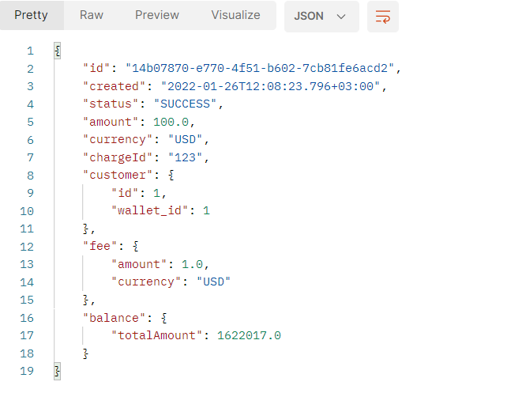
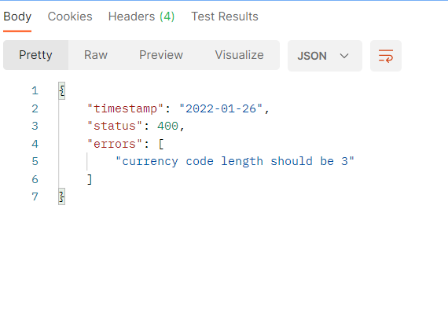

# Topup Wallet API

# Technologies used

- [**Spring Boot**](https://spring.io/projects/spring-boot/)
> Web framework to be used in API.
- [**Hibernate**](https://hibernate.org/)
> ORM based on repository/entity pattern. Also used for validations/relationships with other entities
- [**Project Loombok**](https://projectlombok.org/)
> Boilerplate code reduction using annotations for common java patterns
- [**postgresql**](https://www.postgresql.org/)
> Data storage used to store and index payment data
- [**Docker**](https://www.docker.com/)
> Used for local development setup and well as running all the services combined. Can also help in production deployment and autoscaling
# Implementation Checklist
- API Request Validation
- Hibernate ORM
- JPA Relationships
- Builder Pattern
- Exception Handler
- Postgresql Row level locking
- Unit tests using Junit

# Local setup and running
Install docker on your system
- **MacOS**
> Install homebrew package manager
> ```sh
> /bin/bash -c "$(curl -fsSL https://raw.githubusercontent.com/Homebrew/install/master/install.sh)"
> ```
Install docker desktop and git with brew cask
> ```sh
> brew install git
> brew install --cask docker
> ```

- **Windows**
> Install/Update windows package manager winget (Update app installer package from windows store)

Install docker desktop and gitusing winget
> ```sh
> winget install -e --id Git.Git
> winget install -e --id Docker.DockerDesktop
> ```

- **Ubuntu**

Install docker and git using apt package manager
> ```sh
> sudo apt purge -y docker docker-engine docker.io containerd runc
> sudo apt install -y \
> apt-transport-https \
> ca-certificates \
> curl \
> gnupg-agent \
> software-properties-common
> curl -fsSL https://download.docker.com/linux/ubuntu/gpg | sudo apt-key add -
> echo "deb [arch=amd64] https://download.docker.com/linux/ubuntu $(lsb_release -cs) stable" | sudo tee /etc/apt/sources.list.d/docker.list
> sudo apt update && sudo apt install -y docker-ce docker-ce-cli containerd.io git
> sudo systemctl restart docker
> sudo systemctl enable docker
> sudo curl -L "https://github.com/docker/compose/releases/download/v2.2.2/docker-compose-$(uname -s)-$(uname -m)" -o /usr/local/bin/docker-compose
> sudo chmod +x /usr/local/bin/docker-compose
> sudo groupadd docker
> sudo usermod -aG docker $USER
> newgrp docker
> ```

Fetch code using git
```sh
git clone -j8 https://github.com/aaimabashir9/JAVA-Technical-Assessment.git
```
Move to project directory
```sh
cd JAVA-Technical-Assessment
```
Run project
```sh
docker-compose up
```

**Check API response through curl (or postman)**
Success Request:
```sh

curl --location --request POST 'http://localhost:8080/payment/topupwallet' \
--header 'Accept: application/json' \
--header 'Content-Type: application/json' \
--data-raw '{
"amount":100.0,
"currency":"USD",
"charge_id":"123",
"customer":{
  "id":1,
  "wallet_id":1
},
"fee":{
  "amount":1.0,
  "currency":"USD"
}
}
'
```
**Response:**
```json
{
  "id": "30eefdc7-f608-4a66-ba85-780b1754c8c5",
  "created": "2022-01-26T13:23:22.200+03:00",
  "status": "SUCCESS",
  "amount": 100,
  "currency": "USD",
  "chargeId": "123",
  "customer": {
    "id": 1,
    "wallet_id": 1
  },
  "fee": {
    "amount": 1,
    "currency": "USD"
  },
  "balance": {
    "totalAmount": 199
  }
}
```


Bad Request: with bad currency: 123456
```sh
curl --location --request POST 'http://localhost:8080/payment/topupwallet' \
--header 'Accept: application/json' \
--header 'Content-Type: application/json' \
--data-raw '{
"amount":100.0,
"currency":"123456",
"charge_id":"123",
"customer":{
  "id":1,
  "wallet_id":1
},
"fee":{
  "amount":1.0,
  "currency":"USD"
}
}
'
```
**Response:**
```json
{
  "timestamp": "2022-01-26",
  "status": 400,
  "errors": [
    "currency code length should be 3"
  ]
}
```


